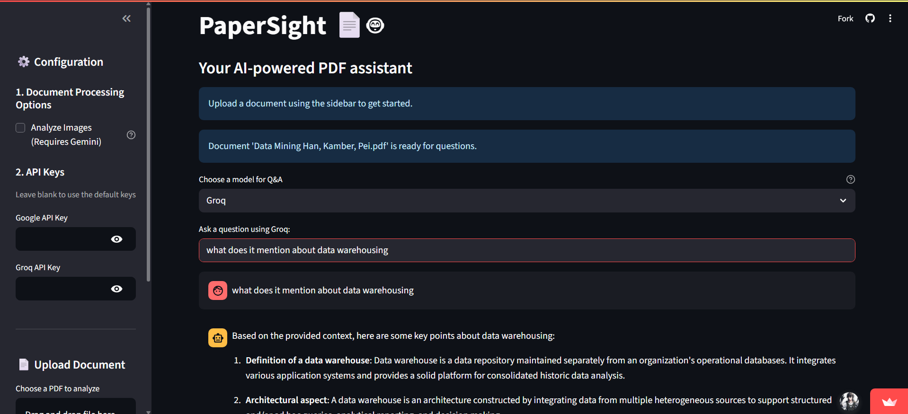

# PaperSight 📄🤖

**An intelligent RAG-based application that transforms static PDF documents into interactive conversational partners, enabling users to query and understand their files with unprecedented ease.**

[](https://www.python.org/downloads/)
[](https://opensource.org/licenses/MIT)
[](https://papersight.streamlit.app)

-----


PaperSight is a user-friendly tool designed to unlock the knowledge within your documents. By uploading a PDF, users can engage in a natural language Q\&A session, receiving accurate, context-aware answers powered by cutting-edge AI models and a robust backend architecture.

-----

## ✨ Core Features

  * **Advanced RAG Pipeline**: Implements a full Retrieval-Augmented Generation pipeline to ensure answers are grounded in the document's content, minimizing hallucinations.
  * **Flexible LLM Integration**: Offers a choice between the high-speed **Groq (Llama 3.1)** for rapid querying and the powerful **Google Gemini** for complex reasoning.
  * **Optional Vision Analysis**: Leverages the Gemini Vision model to analyze and describe charts, graphs, and images within the PDF, integrating visual information into the knowledge base.
  * **Scalable Vector Storage**: Utilizes **Pinecone** for efficient, high-speed similarity searches across document text embeddings.
  * **Persistent & Organized**: Features a **MongoDB** backend to track document namespaces, enabling smart, automated cleanup to manage resources and stay within service limits.
  * **Secure & User-Friendly**: Built with a clean **Streamlit** interface, ensuring that user-provided API keys are handled securely per session and never exposed.

-----

## 🏛️ System Architecture

The application operates on a modern, decoupled architecture designed for efficiency and scalability.

1.  **Frontend**: A user-friendly interface built with **Streamlit** captures user inputs, file uploads, and configuration settings.
2.  **Document Processing**: Uploaded PDFs are parsed using **PyMuPDF**. Text is extracted and, if enabled, images are described by **Gemini Vision**. The combined content is split into structured chunks using **LangChain**.
3.  **Embedding & Storage**: Text chunks are converted into vector embeddings by a **Sentence Transformer** model. These embeddings are then upserted into a dedicated namespace in a **Pinecone** vector index for fast retrieval.
4.  **Metadata Management**: Each new document namespace is logged with a timestamp in a **MongoDB** collection, allowing for a cron-like cleanup of the oldest documents.
5.  **Retrieval & Generation**: When a user asks a question, the query is embedded and used to search Pinecone for the most relevant context chunks. This context is then passed to the user's chosen LLM (**Groq** or **Gemini**) to generate a final, accurate answer.

-----

## 🛠️ Tech Stack

  * **Frontend**: Streamlit
  * **Backend**: Python 3.11+
  * **AI & Machine Learning**:
      * **LLM Providers**: Google Gemini, Groq
      * **Embeddings**: Sentence Transformers (`all-MiniLM-L6-v2`)
      * **Text Splitting**: LangChain
  * **Databases**:
      * **Vector DB**: Pinecone
      * **Metadata DB**: MongoDB
  * **Core Libraries**: PyMuPDF, Pymongo, Dotenv
  * **Package Management**: uv

-----

## 🚀 Local Setup and Installation

Follow these steps to set up and run PaperSight on your local machine.

### 1\. Prerequisites

Make sure you have the following installed:

  * [Python 3.11+](https://www.python.org/downloads/)
  * [Git](https://git-scm.com/)
  * [uv](https://github.com/astral-sh/uv) (Python Package Installer)

### 2\. Clone the Repository

```bash
git clone https://github.com/ap-aditya/PaperSight
cd PaperSight
```

### 3\. Set Up the Environment

Create and activate a virtual environment using `uv`:

```bash
uv venv
source .venv/bin/activate
# On Windows, use: .venv\Scripts\activate
```

### 4\. Install Dependencies

Install all required packages from the `requirements.txt` file:

```bash
uv sync
```

### 5\. Configure Environment Variables

1.  Create your local environment file from the example template:

    ```bash
    cp .env.example .env
    ```

2.  Open the `.env` file and add your credentials. This file is secured by `.gitignore` and will not be committed.

-----

## ▶️ Usage

With your environment configured, start the Streamlit application:

```bash
streamlit run app.py
```

The app will open in your web browser. The standard workflow is:

1.  Use the sidebar to select processing options (e.g., enable image analysis).
2.  Provide API keys if you wish to override the default ones from your `.env` file.
3.  Upload a PDF document and wait for it to be processed.
4.  Once processed, select your preferred Q\&A model in the main interface and begin your conversation\!

-----

## ☁️ Deployment

This application is configured for easy deployment on **Streamlit Community Cloud**.

1.  **Push to GitHub**: Ensure your repository is up-to-date on GitHub, including the `requirements.txt` and `packages.txt` files.
2.  **Link to Streamlit**: In your Streamlit Cloud dashboard, create a "New app" and link it to your GitHub repository.
3.  **Add Secrets**: In the app's **Settings \> Secrets**, paste the contents of your local `.env` file. Streamlit uses TOML syntax, so ensure string values are in quotes (e.g., `KEY = "value"`).
4.  **Deploy**: Let Streamlit work its magic\! Your app will be live and ready to share.